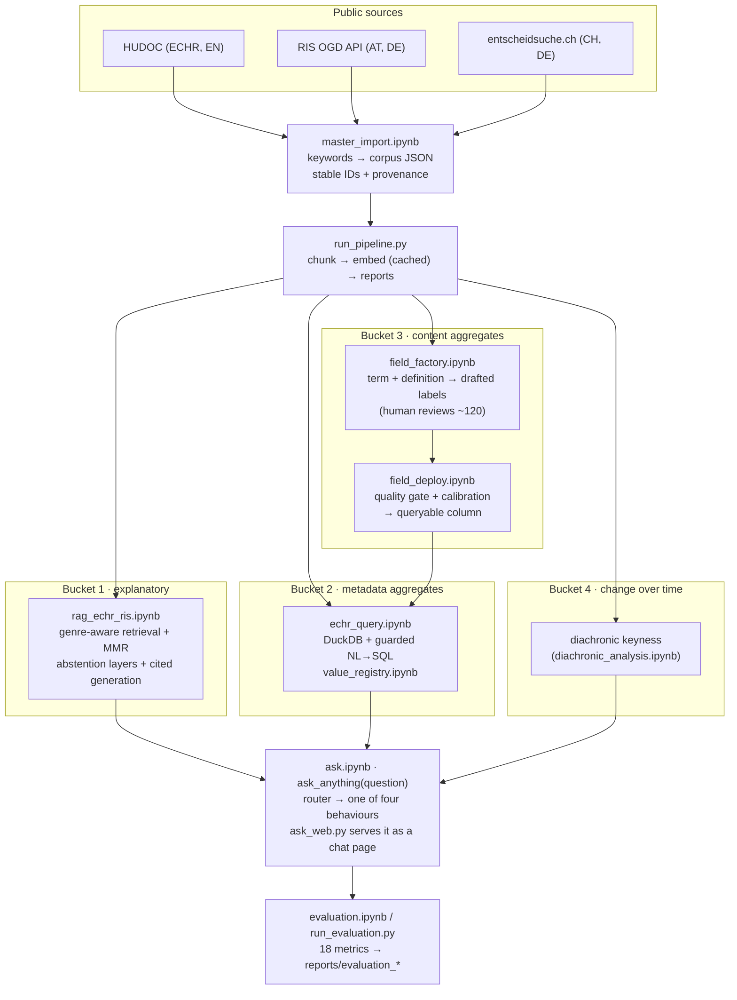

# Faithful Question-Answering over a Multilingual Legal Corpus

Master's thesis code. The system answers natural-language legal questions over three public
case-law sources, **European Court of Human Rights** (EN), **Austrian Supreme Court / RIS**
(DE) and **Swiss courts via entscheidsuche.ch** (DE). It answers each question only in a way
that question type allows faithfully:

| question type | example | how it is answered |
|---|---|---|
| **1 · explanatory** | "How does the Court weigh the child's wishes in contact cases?" | retrieval + grounded generation, every claim cited to a case |
| **2 · metadata aggregate** | "How many cases against Poland found a violation of Art. 8?" | NL→SQL over structured metadata, SQL printed above the result |
| **3 · content aggregate** | "In how many cases was the child heard?" | a validated, calibrated extraction column with a confidence threshold, or an explained refusal if no such column exists |
| **4 · change over time** | "How has the language about alienation changed since 2012?" | keyness evidence across time windows, not a generated narrative |

The central claim is that top-k retrieval **cannot** produce faithful counts or trends. A
router therefore keeps Bucket 2–4 questions away from free-text generation, and the thesis
measures how well that works.

The probe topic is **parental alienation / child welfare** (Entfremdung, Kindeswohl, Obsorge,
Kontaktrecht). It is a stress test, not the subject: the concept does not map cleanly across
languages and jurisdictions. The topic is a parameter (one `KEYWORDS` dict). What it costs to
change it is documented in [`reusability.md`](reusability.md).

**Start here:** [`project_overview.md`](project_overview.md) (reading guide) ·
[`rq_registry.md`](rq_registry.md) (research question → evidence) ·
[`reports/evaluation_summary.md`](reports/evaluation_summary.md) (all current metrics, with CIs) ·
**demo:** `src/ask.ipynb` or the chat page `src/ask_web.py`.

## Corpus

| source | jurisdiction | language | documents | period |
|---|---|---|---|---|
| HUDOC (via `echr-extractor`) | ECHR | EN | 1,574 judgments, decisions, communicated cases | 2000–2025 |
| RIS OGD API | Austria (OGH) | DE | 6,438 decisions + Rechtssätze | 2000–2025 |
| entscheidsuche.ch | Switzerland (federal + cantonal) | DE | 12,174 decisions | 2000–2025 |

All three share one multilingual embedding index (`intfloat/multilingual-e5-base`, exact
cosine, CPU) of **155,164 passages**. Each passage carries its jurisdiction, language, genre,
section and a stable document ID, and citations never cross jurisdictions. Corpora and caches
live in `data/` and are **not committed**. The importer rebuilds them from the public APIs.

## Current results

Recomputed by `src/evaluation.ipynb`. The full table with CIs, tiers and staleness flags is
in [`reports/evaluation_summary.md`](reports/evaluation_summary.md).

| what is measured | result |
|---|---|
| Router: 3-way route accuracy (frozen 80-question gold set, 4 buckets, 40 DE / 40 EN) | **0.812** [0.713, 0.883] |
| Router: known gap | 12/20 change-over-time questions reach retrieval, 10 of them German. The German Bucket-4 trigger has no patterns yet |
| Evidence grounding: extracted evidence snippets found verbatim in the source (150/150) | **1.0** [0.975, 1.0] |
| Citation precision: cited case IDs that were actually shown to the model | **0.976** [0.917, 0.993] |
| Content field `applicant_is_father`: best extractor F1 | **0.783** |
| Calibration protocol (isotonic, 5-fold out-of-fold), ECE | **0.179 → 0.068** (5 bins); holds on 2000–14 transfer data (0.084) |
| Synthetic NL→SQL execution accuracy | **1.0** [0.898, 1.0] |
| Trap questions correctly refused | **5/6** |

Retrieval precision@6 (0.451) and the **genre finding** are still valid as findings but were
measured on an earlier index, so the summary marks them `STALE`. The genre finding is that
ECHR hits are relevant only when they land in the Court's own LAW section. The first
extraction field, `alienation_alleged` (rules F1 0.507 vs local LLM F1 0.593), validated the
calibration protocol. It was retired from the query surface on 2026-09-21.

## Architecture



## Repository layout

```
src/        notebooks and scripts (see below)
reports/    one markdown/json report per result family, the evaluation summary,
            field reports, value registry            (committed)
figures/    headline figures + architecture diagram   (committed)
data/       corpora, embedding cache, gold labels, extraction tables  (never committed)
archive/    superseded snapshots and pre-pivot work, kept for provenance
```

### `src/` by role

| role | files |
|---|---|
| **entry points** | `ask.ipynb` (the proof of concept), `ask_web.py` + `ask_web.html` (chat UI on `127.0.0.1:8765`) |
| **corpus** | `master_import.ipynb`, `corpus_io.py`, `corpus_audit.ipynb` (noise shortlist, human verifies), `data_summary.ipynb`, `corpus_distributions.ipynb`, `ris_recall_probe.ipynb` |
| **pipeline runners** | `run_pipeline.py` (embed + regenerate reports), `run_evaluation.py` (re-run evaluation, export HTML) |
| **Bucket 1** | `rag_echr_ris.ipynb`, `retrieval_evaluation.ipynb`, `citation_check.py` |
| **Bucket 2** | `echr_query.ipynb`, `value_registry.ipynb`, `echr_theme_classify.py`, `theme_classify_zeroshot.py` |
| **Bucket 3** | `field_factory.ipynb`, `field_deploy.ipynb`; the original field: `echr_extraction.ipynb`, `extraction_validation.ipynb`, `echr_extraction_llm.ipynb`, `extraction_domain_shift.ipynb` |
| **Bucket 4 / worked examples** | `diachronic_analysis.ipynb`, `echr_framing_analysis.ipynb` |
| **metadata analytics** | `citation_network.ipynb`, `trends_and_variation.ipynb`, `principle_faithfulness.ipynb` |
| **evaluation** | `evaluation.ipynb`, `eval_metrics.py`, `router_evaluation.ipynb`, `scope_selftest.py` (sweeps every queryable metadata dimension against the shipped scope code) |

### Deployed content fields

Each field is a calibrated column with per-cell confidence and provenance. `ask.ipynb`
discovers deployed fields automatically. The reports are in `reports/field_<name>_report.md`.

`applicant_is_father` · `child_heard` · `coercive_measures` · `expert_opinion_ordered`

## Running

Requirements: Python 3.9 in `.venv`. Notebooks are executed in-process with the venv
interpreter, because `jupyter` on the development machine resolves to a different install.

```bash
# 1. models
ollama serve &                      # NL->SQL (qwen2.5-coder:3b); local generation fallback (llama3.2)

# 2. generation backend: hosted open-weight model by default (Groq, openai/gpt-oss-120b)
echo "GROQ_API_KEY=..." >> .env     # .env is gitignored
#    or set GEN_BACKEND = "ollama" in rag_echr_ris.ipynb to stay fully local

# 3. build a corpus: run master_import.ipynb, then
cd src
../.venv/bin/python run_pipeline.py            # embed (hours on CPU, resumable) + all reports

# 4. ask
../.venv/bin/python ask_web.py                 # http://127.0.0.1:8765
#    or open ask.ipynb

# 5. evaluate
../.venv/bin/python run_evaluation.py          # -> reports/evaluation.html, evaluation_summary.md
../.venv/bin/python scope_selftest.py          # after changing the scope logic in ask.ipynb
```

Generation moved from local `llama3.2` to a hosted open-weight model because of hardware
limits (~15 min per answer on the development laptop). The reasons and the before/after
measurements are in [`reports/backend_migration.md`](reports/backend_migration.md).
Retrieval, NL→SQL and extraction still run locally.
