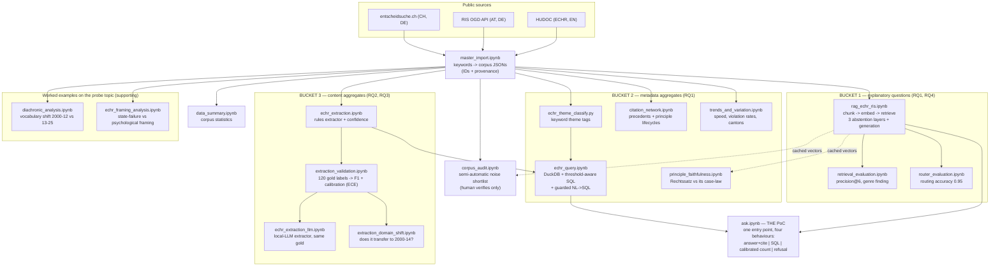

# Faithful Question-Answering over a Multilingual Legal Corpus

A generic, reusable pipeline (topic = one keyword dict) over three public legal sources —
**ECHR** (EN), **Austrian OGH/RIS** (DE), **Swiss entscheidsuche.ch** (DE) — that answers
legal questions **only in the way each question type can be answered faithfully**: retrieval
with citations, exact SQL over metadata, calibrated extraction with abstention, or an
explained refusal. Probe topic: parental alienation / Kindeswohl. Everything runs local +
CPU, no paid APIs.

**Start here:** [`project_overview.md`](project_overview.md) (reading guide + all headline
numbers) · [`rq_registry.md`](rq_registry.md) (RQ → evidence map) ·
[`reusability.md`](reusability.md) (what it costs to change topic) ·
**demo:** `src/ask.ipynb` (needs `ollama serve` running).

## Pipeline



## What asks what (and why)

| stage | notebook | the question it answers | why it exists |
|---|---|---|---|
| **corpus** | `master_import.ipynb` | build the corpus for a topic (2000–2025, 3 sources) | topic is a parameter; IDs + provenance make every number traceable |
| | `corpus_audit.ipynb` | which documents are noise? | replaces manual curation with a verified shortlist (blind recovery: 100 % of known noise in bottom decile) |
| | `data_summary.ipynb` | what does the corpus contain? | read-only sanity check; `reports/data_registry.json` lists every field |
| **RQ1 — capability boundary** | `rag_echr_ris.ipynb` | can retrieval answer explanatory questions with citations — and refuse the rest? | the Bucket-1 engine + 3 abstention layers |
| | `router_evaluation.ipynb` | does the router keep aggregates away from generation? | accuracy 0.95, fabrication risk 0.10 (n=60, Wilson CIs in report) |
| | `retrieval_evaluation.ipynb` | is what retrieval returns actually usable? | precision@6 ≈ 0.45–0.47, the replicated genre finding (only court reasoning counts) |
| **RQ2 — extraction** | `echr_extraction.ipynb` | can a transparent rule turn prose into a queryable column? | one field (`alienation_alleged`), every cell with confidence + provenance |
| | `extraction_validation.ipynb` | how good is it, honestly? | F1 0.507 on 120 gold labels; the only place labels are read |
| | `echr_extraction_llm.ipynb` | does a local LLM beat the rules? | F1 0.593, same gold — the transparency/accuracy trade-off |
| **RQ3 — calibrated abstention** | `extraction_validation.ipynb` | does 0.8 mean 80 %? | ECE 0.179 → 0.068, validated out-of-fold |
| | `extraction_domain_shift.ipynb` | does "label once" survive a domain change? | calibration transfers to 2000–14: ECE 0.084 |
| **RQ4 — cross-lingual** | `rag_echr_ris.ipynb` + `retrieval_evaluation.ipynb` | do German queries reach German law? | 42k-chunk shared index; DE→AT/CH, EN→ECHR, measured |
| **Bucket-2 analytics** | `echr_query.ipynb` | quantitative questions over metadata, threshold-aware | the SQL counter the router hands off to; guarded NL→SQL |
| | `citation_network.ipynb` | which precedents/principles structure this law? | topic-agnostic result family from citation metadata |
| | `trends_and_variation.ipynb` | did Strasbourg get faster? who finds violations? cantonal practice? | topic-agnostic metadata trends |
| | `principle_faithfulness.ipynb` | do Rechtssätze match their case-law? | embedding-geometry check of a legal-genre assumption |
| **worked examples** | `diachronic_analysis.ipynb`, `echr_framing_analysis.ipynb` | how did vocabulary/framing shift? | supporting evidence; produce reading shortlists, not findings |
| **PoC** | `ask.ipynb` | one entry point, any question | the typology as one executable function — open this first |

## Layout

```
src/       18 active notebooks/scripts (see table above)
data/      corpora, caches, gold labels, extraction tables   (never committed)
reports/   one markdown/json report per result family        (committed)
figures/   one png per headline figure                       (committed)
archive/   corpus snapshots + archive/legacy/ (pre-pivot Reddit/news-era work,
           superseded scrapers, stale exports — kept for provenance)
```

## Running

```bash
# environment: .venv (python 3.9) has everything; jupyter falls through to anaconda,
# so run notebooks in-process with the venv interpreter.
ollama serve &          # needed for generation + NL->SQL (llama3.2, qwen2.5-coder:3b)
# order for a fresh topic: master_import -> corpus_audit -> rag_echr_ris (embeds, hours)
# -> echr_extraction -> extraction_validation -> echr_theme_classify.py -> echr_query
# -> evaluations -> ask
```
